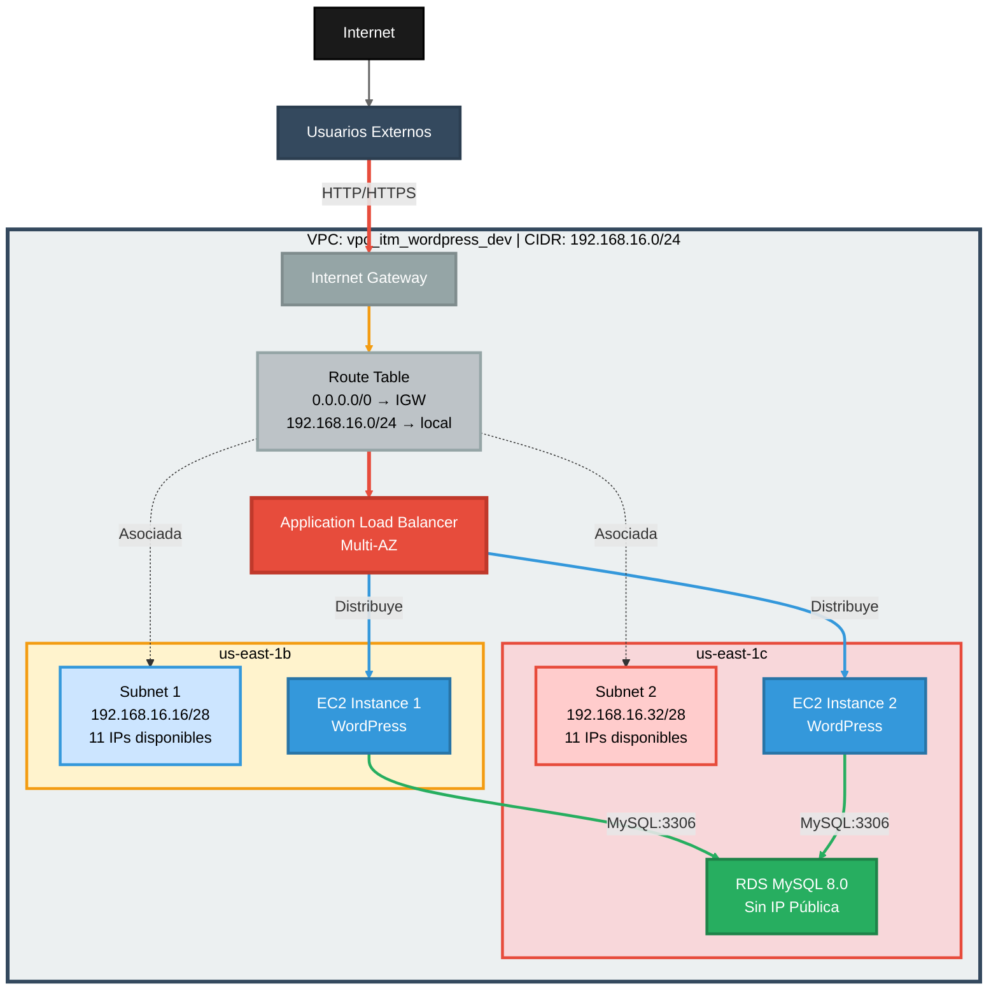

# WordPress en AWS con Terraform

Despliegue automático de WordPress en AWS usando Terraform.

## ¿Qué crea?

- **VPC** con 2 subnets en diferentes zonas
- **Auto Scaling Group** (1-3 servidores EC2)
- **RDS MySQL 8.0** con backups automáticos
- **Application Load Balancer** para distribuir tráfico
- **Security Groups** configurados por capas

## Diagrama de Arquitectura VPC



**Componentes de la VPC**

| Componente | Especificaciones |
|------------|------------------|
| VPC | vpc_itm_wordpress_dev - 192.168.16.0/24 |
| Subnet 1 | us-east-1b - 192.168.16.16/28 (11 IPs) |
| Subnet 2 | us-east-1c - 192.168.16.32/28 (11 IPs) |
| Route Table | public_rt - Asociada a ambas subnets |
| Internet Gateway | Adjunto a VPC para tráfico público |

**Flujo de Tráfico**
1. Usuarios → Internet Gateway
2. IGW → Route Table → ALB
3. ALB distribuye entre EC2-1 y EC2-2 (Multi-AZ)
4. Instancias EC2 conectan a RDS vía MySQL:3306

## Requisitos

1. Terraform instalado
2. AWS CLI configurado
3. SSH Key Pair en AWS (este proyecto usa "vockey")
4. Bucket S3: `joiangon.tfstates2025`

## Instalación

### 1. Configurar variables

```bash
cd c:\Users\Usuario\Documents\aws\.terraform
cp terraform.tfvars.example terraform.tfvars
```

Editar `terraform.tfvars`:
```hcl
aws_region  = "us-east-1"
aws_profile = "default"

db_name     = "wordpressdb"
db_username = "admin"
db_password = "TuPassword123"  # Sin: / @ " espacios

key_name = "vockey"
```

### 2. Desplegar

```bash
terraform init
terraform workspace select dev
terraform plan
terraform apply
```

### 3. Acceder

```bash
terraform output wordpress_url
```

Abrir la URL en el navegador.

## Configuración de WordPress

Cuando pida datos de BD:

```bash
terraform output db_instance_endpoint
```

Usar:
- **Database Name:** wordpressdb
- **Username:** admin
- **Password:** La de terraform.tfvars
- **Host:** El endpoint del comando anterior

## Ambientes

**Default:** Producción (us-east-1a, us-east-1b)
**Dev:** Desarrollo (us-east-1b, us-east-1c)

```bash
terraform workspace list
terraform workspace select dev
```

Para ahorrar: `terraform destroy` cuando no se use.

## Comandos útiles

**Ver estado:**
```bash
terraform output
```

**Health check del load balancer:**
```bash
aws elbv2 describe-target-health \
  --target-group-arn $(terraform output -raw target_group_arn)
```

**SSH a servidor:**
```bash
# Obtener IP
aws ec2 describe-instances \
  --filters "Name=tag:Name,Values=ec2_itm_wordpress_dev" \
  --query "Reservations[*].Instances[*].[PublicIpAddress]" \
  --output text --region us-east-1

# Conectar
ssh -i vockey.pem ec2-user@<IP>
```

## Problemas comunes

**WordPress no carga:**
- Esperar 15 minutos después del apply
- Verificar health: `terraform output` y revisar target health

**Error de contraseña BD:**
- No usar: `/`, `@`, `"`, espacios
- Mínimo 8 caracteres

**Error de keypair:**
- Verificar que existe: `aws ec2 describe-key-pairs --region us-east-1`

## Backups

- Automáticos diarios a las 3 AM UTC
- Se guardan 7 días

Manual:
```bash
aws rds create-db-snapshot \
  --db-instance-identifier vpc-itm-wordpress-dev-db \
  --db-snapshot-identifier backup-$(date +%Y%m%d)
```

## Eliminar todo

```bash
terraform destroy
```

Esto borra todos los recursos (crea snapshot final de RDS).

## Estructura

```
.
├── main.tf              # Configuración principal
├── variables.tf         # Variables
├── outputs.tf           # Salidas
├── providers.tf         # AWS + backend S3
└── modules/
    ├── VPC/             # Red
    ├── SecurityGroups/  # Firewall
    ├── RDS/             # Base de datos
    ├── EC2/             # Servidores
    └── ALB/             # Load balancer
```

## Versión

**v1.0.0 (2025)** - VPC, Auto Scaling, RDS, ALB

## Autores

- Joiver Andres Gonzalez Coronado
- Carlos Felipe Caro Arroyave

## Soporte

- Logs: `ssh ec2-user@<IP>` → `/var/log/cloud-init-output.log`
- Docs Terraform: https://www.terraform.io/docs
- Docs AWS: https://docs.aws.amazon.com
